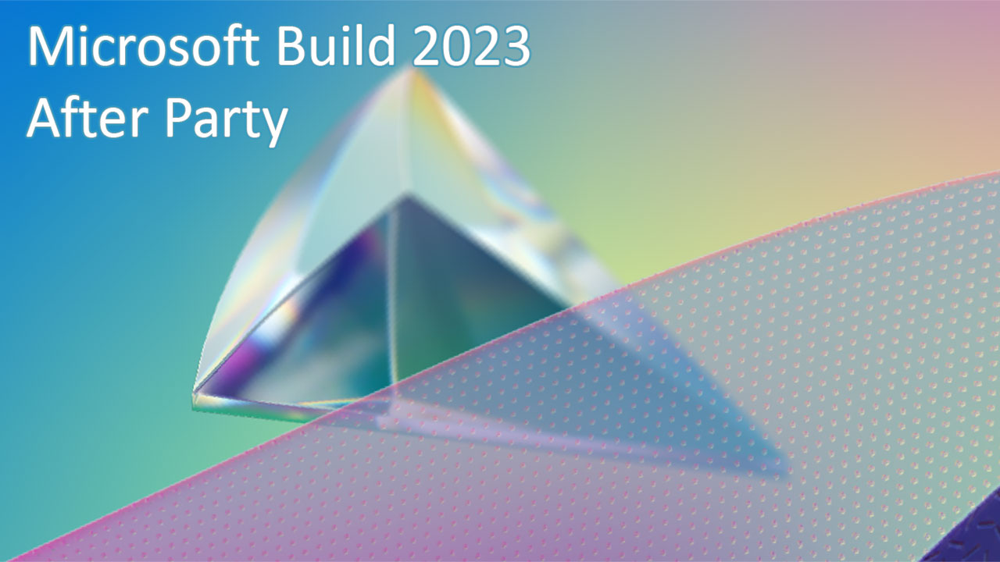

# Microsoft Build After Party - Windows
Presentation for the [Dot Net North](https://www.meetup.com/DotNetNorth) 'Microsoft Build After Party' event in July 2023. An overview of what's new for Windows Developers. [Meetup listing](https://www.meetup.com/dotnetnorth/events/293910493/).

[Presentation Link](https://github.com/mikeirvingweb/msbuildafterparty23-windows/raw/main/presentation/2023-07-11-Mike-Irving-Windows.pptx)

**Windows**

- **Dev Home**
  - Including Dev Drive

- **Windows Subsystem for Android™️**
  - Opportunities for developers
  - Amazon Appstore		
  - Debugging Android Apps  

---

**Links from presentation**

**Dev Home**  
🛍️ [Dev Home - Microsoft Store](https://aka.ms/devhome)  
🏠 [Dev Home - Microsoft Learn](https://learn.microsoft.com/en-us/windows/dev-home/)  
💾 [Dev Drive - Microsoft Learn](https://learn.microsoft.com/en-us/windows/dev-drive/)  

**Windows Subsystem for Android™️**  
🤖 [Windows Subsystem for Android - Microsoft Learn](https://learn.microsoft.com/en-us/windows/android/wsa/)  
🛍️ [Amazon Appstore - Microsoft Store](https://www.microsoft.com/store/productId/9NJHK44TTKSX)  
📄 [Amazon Appstore on Windows 11 - Amazon Documentation](https://developer.amazon.com/apps-and-games/appstore-on-windows-11)  

**Commands from presentation**

launch WSA from command line  
`WsaClient /launch wsa://system`  

connect to WSA from command line (check IP/Port match those in your WSA Setting App)  
`adb connect 127.0.0.1:58526`  

---
For more info, find / contact me at:  
[Twitter](https://twitter.com/mikeirvingweb) • [LinkedIn](https://www.linkedin.com/in/mikeirving) • [GitHub](https://github.com/mikeirvingweb) • [Stack Overflow](https://stackoverflow.com/users/482901/mike-irving) • [Website & Blog](https://www.mike-irving.co.uk/)
